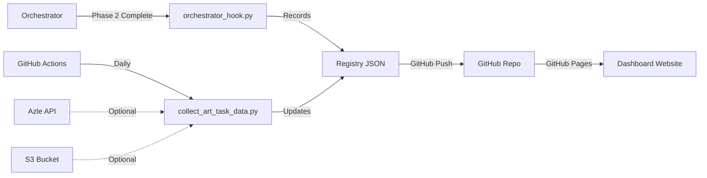

# Art Task Dashboard Automation Setup

## 🚀 Overview

This dashboard now supports **automatic updates** from the Art Task Plan pipeline.

## 🔧 Setup Instructions

### 1. GitHub Secrets Configuration

Go to your repository settings and add these secrets:

- `AZLE_API_TOKEN` - Your Azle API token (optional, for KB stats)
- `AWS_ACCESS_KEY_ID` - AWS access key for S3 (optional)
- `AWS_SECRET_ACCESS_KEY` - AWS secret key (optional)

### 2. Orchestrator Integration

Add this to your Art Task Plan Orchestrator (Phase 2 completion):

```python
# In art_task_plan_orchestrator.py, after Phase 2 completion:

import subprocess

def record_to_dashboard(iteration, evaluation_file, thread_id):
    """Record results to GitHub dashboard"""
    try:
        subprocess.run([
            "python",
            "/path/to/art-task-dashboard/scripts/orchestrator_hook.py",
            "--iteration", str(iteration),
            "--evaluation-file", evaluation_file,
            "--thread-id", thread_id,
            "--auto-push"  # Auto-push to GitHub
        ], check=True)
        print(f"✅ Recorded iteration {iteration} to dashboard")
    except Exception as e:
        print(f"⚠️ Dashboard recording failed: {e}")
        # Don't fail the pipeline if dashboard update fails

# Call after evaluator completes:
record_to_dashboard(
    iteration=current_iteration,
    evaluation_file=f"/tmp/evaluation/iteration_{current_iteration}.json",
    thread_id=orchestrator_thread_id
)
```

### 3. Automatic Daily Updates

The GitHub Actions workflow runs automatically:
- **Daily at 9:00 AM KST** (00:00 UTC)
- **Manual trigger** via GitHub Actions UI
- **On push** to scripts or workflow files

## 📊 Data Flow



## 🎯 Features

### Real-time Pipeline Integration
- Orchestrator calls hook script after each iteration
- Results automatically recorded to `registry/master_registry.json`
- Dashboard updates immediately after GitHub Pages rebuild

### Daily KB Statistics Update
- Fetches latest KB entity counts from Azle API (if configured)
- Falls back to simulated growth if API not available
- Updates `dashboard-data/kb_statistics.json`

### Registry Management
- Each iteration stored in `registry/iteration_{N}.json`
- Master registry maintains all iterations
- Automatic calculation of trends and averages

## 🔍 Testing

### Test Manual Update:
```bash
# Trigger GitHub Actions manually
gh workflow run update-registry.yml

# Or run locally
python scripts/collect_art_task_data.py
python scripts/update_kb_stats.py
python scripts/generate_registry.py
```

### Test Orchestrator Hook:
```bash
# Simulate orchestrator call
python scripts/orchestrator_hook.py \
    --iteration 11 \
    --evaluation-file test_eval.json \
    --thread-id "test_thread_123"
```

## 📈 Monitoring

Check automation status:
- **GitHub Actions**: https://github.com/kwakseungmin-Lab/art-task-dashboard/actions
- **Dashboard**: https://kwakseungmin-lab.github.io/art-task-dashboard/
- **Registry Data**: https://github.com/kwakseungmin-Lab/art-task-dashboard/tree/main/registry

## 🛠 Troubleshooting

### Dashboard not updating?
1. Check GitHub Actions logs for errors
2. Verify secrets are configured correctly
3. Ensure orchestrator is calling the hook script

### KB statistics incorrect?
1. Check if `AZLE_API_TOKEN` is set in GitHub secrets
2. Verify API endpoint is accessible
3. Falls back to simulated data if API unavailable

### Registry missing iterations?
1. Check orchestrator logs for hook call
2. Verify evaluation file format
3. Check git push permissions

## 📝 Notes

- The dashboard uses **GitHub Pages** for hosting (static site)
- Updates are **near real-time** (1-2 minute GitHub Pages rebuild)
- All data stored as JSON files in the repository
- No database required - everything is file-based